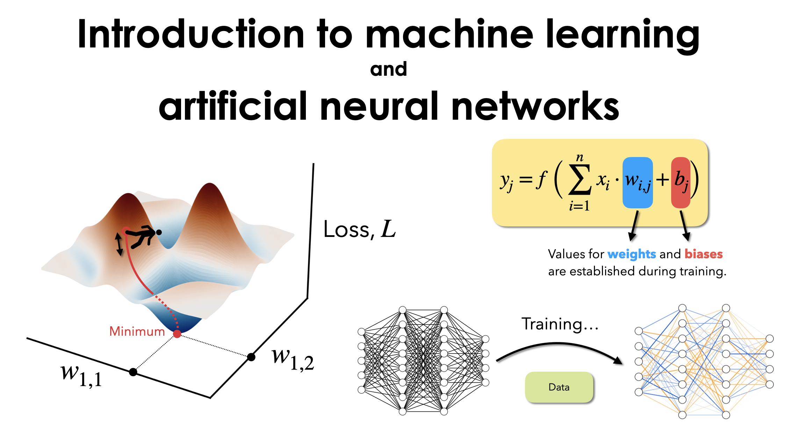

# Open-source teaching materials

## Reinforcement learning 101

### Can we give machines a growth mindset? A gentle introduction to the Bellman equation

📹 Video is available [here](https://youtu.be/ookYeokJPiA).

💻 Jupyter notebook is available [here](reinforcement-learning-101/Bellman-equation-numerical-solver.ipynb).

## Introduction to machine learning and artificial neural networks

📹 Video of the lecture is available [here](https://youtu.be/IGEWE81FWMA).

💻 Jupyter notebook is available [here](intro-to-ml-and-anns/ML-lecture.ipynb).

