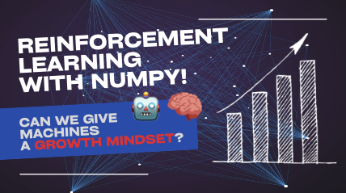
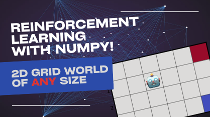

# Open-source teaching materials

***

## Reinforcement learning 101

### A gentle introduction to the Bellman equation

📹 Video is available [here](https://youtu.be/ookYeokJPiA).

💻 Jupyter notebook is available [here](reinforcement-learning-101/01-Gentle-introduction-to-the-Bellman-equation.ipynb).

### Solving an arbitrary 2D grid world

📹 Video is available [here](https://youtu.be/Up6XSRWlcb4).

💻 Jupyter notebook is available [here](reinforcement-learning-101/02-Solving-the-Bellman-equation-for-arbitrary-2D-grid-world.ipynb).

***

## Introduction to machine learning and artificial neural networks

📹 Video of the lecture is available [here](https://youtu.be/IGEWE81FWMA).

💻 Jupyter notebook is available [here](intro-to-ml-and-anns/ML-lecture.ipynb).

***